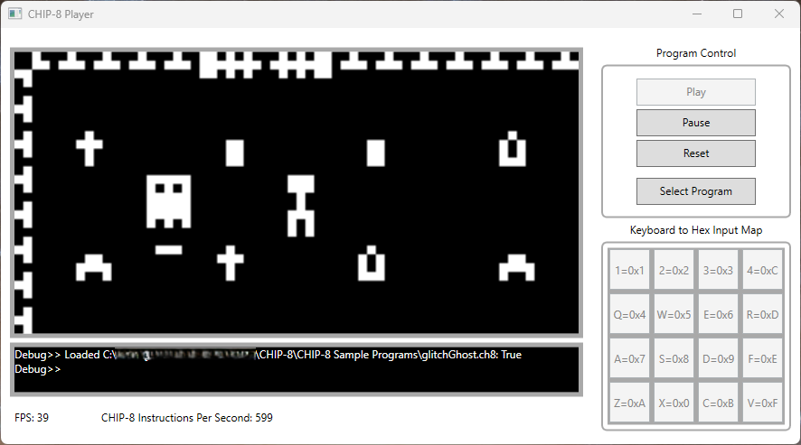
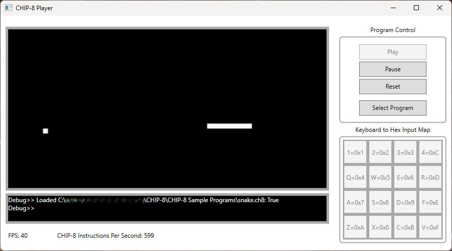

# CHIP-8

This repository contains two projects, both written in C#:
- a [CHIP-8 virtual machine class library](#chip8-virtualmachine) (.\src\CHIP8-VirtualMachine),
- a [CHIP-8 player application](#chip8-player) (.\src\CHIP8-Player).

It also contains:
- a build of the CHIP-8 player application (.\\"CHIP-8 Player"),
- some sample CHIP-8 programs, written by others (.\\"CHIP-8 Sample Programs").

See [Acknowledgements](#acknowledgements) section for the original authors of the CHIP-8 sample programs.


*Glitch Ghost (CC0 public domain), from https://johnearnest.github.io/chip8Archive/*


## Table of Contents

[What is CHIP-8?](#what-is-chip-8)

[CHIP8-VirtualMachine](#chip8-virtualmachine)

[CHIP8-Player](#chip8-player)

[Acknowledgements](#acknowledgements)

[CHIP-8 Specification (Summary)](#chip-8-specification-summary)

[CHIP8-VirtualMachine Class Reference](#chip8-virtualmachine-class-reference)


## What is CHIP-8?

CHIP-8 is a simple virtual machine specification.
Users can write simple low-level programs, such as arcade games, and load them into a CHIP-8 virtual machine for execution.
Programs written for CHIP-8 are composed of hexadecimal values corresponding to CHIP-8 virtual machine opcodes.

Find a brief summary of the CHIP-8 specification [here](#chip-8-specification-summary).


## CHIP8-VirtualMachine

CHIP8-VirtualMachine is a C# .NET class library implementing the CHIP-8 virtual machine specification.

The class library provides a simple [public interface](#chip8_virtualmachine-public-methods) for:
- loading CHIP-8 programs from *.ch8 files,
- flagging when a render is due (and unsetting the flag),
- flagging whether an audible beep should occur,
- sending keypad state,
- running a single fetch-decode-execute step,
- and directly reading a main memory address.

The class also publically exposes the CHIP-8 virtual machine's [screen buffer](#chip8_virtualmachine-public-fields) as a 2D byte array indicating how the next frame should be drawn - the user of the class should read from this field when they are drawing display output.
The virtual machine will only ever use this field as output for telling the user how to draw the current frame, and its state won't affect the virtual machine's internal main memory or registers.
Therefore, it is safe for a user to write to this buffer, but doing so may cause unintended artifacts in the frames due to the CHIP-8 specification requiring that 'on' pixels be drawn in an XOR fashion (if an 'on' is to be drawn at a particular pixel, and it is already 'on', then the resulting written value is 'on' XOR 'on' == 'off').

To keep the class library independent from a particular choice of UI, it is the responsibility of the user of the class to:
- execute *.ch8 programs at a desired frequency,
- update a display from the screen buffer when a render is due,
- play an audible sound when a beep is expected,
- and update the state of key presses.

If using multiple threads to manage UI and CHIP8-VirtualMachine concurrently, it is up to the user to ensure that direct access to the screenBuffer and indirect access via the ExecuteCycle method are thread-safe (ExecuteCycle can modify the contents of screenBuffer).
Similarly, care should be taken to ensure that code is thread-safe when sending key press states to the CHIP8-VirtualMachine, because the ExecuteCycle method may read the contents of the internal key state variables.

The class [constructor](#constructor) must be provided with the number of instruction cycles per 1/60 of a second for properly updating timers.
This must be determined by the class user based on their set execution rate (*i.e* if executing a *.ch8 program at 600 Hz, then the timers should update every 600 * 1/60 = 10 instruction cycles).


## CHIP8-Player

CHIP8-Player is a demo application built in WPF for loading, running, and displaying CHIP-8 programs (*.ch8).
It implements a frontend for user interaction, with the CHIP8-VirtualMachine class library serving as the backend.

*Note: due to compatibility issues and ambiguity between various editions of CHIP-8 over the years, not all ch8 programs will behave as expected.*

*Note: WPF was selected for the user interface in order to implement the UI design in a fast and simple manner to demonstrate the use of CHIP8-VirtualMachine, but WPF is not generally performant for updating images at a fast and constant FPS (updates to graphical components are part of the dispatcher queue), so you may notice the FPS count at the bottom of the window change quite a bit depending on how often the display needs to be rendered again.*



To run a CHIP-8 program, simply click the "Select Program" button and select a *.ch8 file.
The debug window will indicate whether or not the program has been successfully loaded into the virtual machine's memory.
You can then click the "Play" button to start running the loaded program.
You can use the "Pause" button to halt execution of the program (and press "Play" again to resume), and you can use the "Reset" button to revert the CHIP-8 program to it's initial conditions (press "Play" to start running again).

CHIP8-Player executes the CHIP-8 virtual machine in a separate thread at 600 Hz (this rate can be viewed under the debug display).
Despite different CHIP-8 instructions originally varying quite a bit in execution time, a constant execution rate of 500 to 600 Hz is generally considered to give a good user experience.

For the display screen, in the top-left corner of the application window, each pixel in the screen buffer of the CHIP-8 virtual machine is upscaled to a 4x4 block of pixels for better clarity of the rendered image.

For keyboard input, the following key-to-hex mapping is enforced
- "1" == 0x1, "2" == 0x2, "3" == 0x3, "4" == 0xC,
- "Q" == 0x4, "W" == 0x5, "E" == 0x6, "R" == 0xD,
- "A" == 0x7, "S" == 0x8, "D" == 0x9, "F" == 0xE,
- "Z" == 0xA, "X" == 0x0, "C" == 0xB, "V" == 0xF.

This mapping corresponds to the left-most 4-by-4 grid of alphanumeric keys on most English keyboards, with assigned keys looking similar to that of a dedicated number pad.
A visualization of this key mapping can be found in the bottom-right corner of the application window.

The CHIP-8 virtual machine is executed in a separate thread using stopwatches (with system clock resolution) to achieve the stable execution rate of 600Hz. For consistency, the CHIP-8 virtual machine is told to decrement the delay and sound timer values by one every 10 instruction cycles, yielding 60 decrements per second as per the specification.

Due to the implementation of Console.Beep in .NET, beeps made by CHIP8-Player will not play on internal audio devices, however they can be heard through external speakers or headphones.


## Acknowledgements

For development and testing, I have made use of:
- https://chip-8.github.io/links/ (lots of CHIP-8 documentation)
- https://github.com/corax89/chip8-test-rom (a .ch8 program that tests if various opcodes are working)
- https://github.com/mattmikolay/chip-8/ (the Cavern and Heart Monitor programs are cute)

and all sample programs in the two GitHub repos above will work as expected.

The CHIP-8 sample programs in this repository have been written by others for public domain (CC0). They are taken from:
- https://github.com/JohnEarnest/chip8Archive (CC0 "No Rights Reserved" license),
- https://johnearnest.github.io/chip8Archive/ (CC0 "No Rights Reserved" license).

There are also many programs to be found in the following repo:
- https://github.com/dmatlack/chip8/tree/master/roms

however it contains programs for various editions and extensions of CHIP-8, so many may not work as expected.


## CHIP-8 Specification (Summary)

The CHIP-8 virtual machine specification includes the following items:


### Registers

- 16 8-bit general purpose registers (V0 - VF),
- A 16-bit program counter register (PC) holding the address of the next opcode to be fetched from memory,
- A 16-bit index register (I) used to specify an address in memory for reading/writing data,
- An 8-bit delay timer register that, when its contained value is non-zero, should have its value decremented by one at a rate of sixty times per second,
- An 8-bit sound timer register that, when its contained value is non-zero, should cause the CHIP-8 machine to emit an audible beep and should have its value decremented by one at a rate of sixty times per second. In addition, this register will only respond to being written values greater than or equal to 0x02 (0x01 cannot be written to the register).

### Memory

- 4kB (4096 bytes) of main memory, addressed using the 12 least significant bits of the 16 bit index register (I),
- Memory addresses 0x0000 to 0x01FF are reserved for the CHIP-8 interpreter and font symbol data, and CHIP-8 program writers should avoid writing to these memory addresses (unless they really know what they are doing),
- A call stack and call stack index allowing CHIP-8 programs to run nested subroutines. The call stack is specified to have space for 12 addresses, however sometimes it is implemented with more space.

### IO

- A display buffer for writing black and white pixel data. The display should be 32 pixels in height and 64 pixels in width, with 0 specifying a black pixel and 1 specifying a white pixel,
- A hexadecimal keyboard for sending user input as single hexadecimal digits to the CHIP-8 virtual machine.

### Opcodes & Programs

- CHIP-8 opcodes consist of two bytes, with the most significant nibble (4 bits) corresponding to the primary instruction, and the following three nibbles (12 bits) corresponding to further instruction types, register names, and hexadecimal literals,
- Originally, CHIP-8 opcodes varied quite a bit in terms of the rate of execution, however as a rule a constant instruction execution rate of 500Hz to 600Hz is considered to give an acceptable user experience,
- CHIP-8 programs are assumed to begin at memory address 0x0200, so this is where programs should be loaded into memory.

### Font Data

- 4 pixel width by 5 pixel height font data is stored for each of the hexadecimal digits 0x0 to 0xF somewhere in the CHIP-8 interpreter memory range 0x0000 to 0x01FF.


## CHIP8-VirtualMachine Class Reference

[Constructor](#constructor)

[Public Fields](#chip8_virtualmachine-public-fields)

[Public Methods](#chip8_virtualmachine-public-methods)

[Private Fields](#chip8_virtualmachine-private-fields)

[Private Methods](#chip8_virtualmachine-private-methods)


### Constructor

```
public CHIP8_VirtualMachine(uint cyclesPerTimerTick)
```
Initialize a CHIP-8 virtual machine object.
The user must provide the number of instructions per delay/sound timer tick, which should correspond to 60 timer ticks per second.
The exact number will depend on the rate at which the ExecuteCycle() method is called.


### CHIP8_VirtualMachine Public Fields

```
public byte[,] screenBuffer = new byte[32, 64]
```

A field holding the screen buffer, which a user can use for rendering output to a display.
The pixel state at row i and column j is given by
```
screenBuffer[i,j]
```

Whenever a CHIP8_VirtualMachine object updates its screenBuffer field, it will set an internal "render due" flag to true, that can be accessed via the IsRenderDue() method.
This flag, as its name suggests, indicates that the user should redraw the display, so you can save compute when the screen buffer has not changed.
After rendering, the user should call the UnsetRenderDueFlag() method to set the internal "render due" flag back to false.


### CHIP8_VirtualMachine Public Methods

```
public bool LoadProgram(string filename)
```
Load the *.ch8 program file, given by the path filename, into the CHIP-8 virtual machine's main memory starting at the program entry point (0x0200).

```
public bool IsRenderDue()
```
Check a flag indicating whether or not the display needs to be rendered from the screenBuffer again.

```
public void UnsetRenderDueFlag()
```
Unset the flag indicating that the display needs to be rendered again.

```
public bool IsBeepPlaying()
```
Check an internal CHIP-8 virtual machine flag that is set when the sound timer indicates that the program is making an audible beep.

```
public byte ReadAddress(ushort address)
```
Read a byte in the CHIP-8 virtual machine main memory, at the address provided. Not required for program execution.

```
public void SendKeypadState(bool[] keypadState)
```
Provide the current key press state to the CHIP-8 virtual machine.
This should be a bool array with 16 entries corresponding to the hex keys 0x0 to 0xF, indicating if each particular key is pressed down.

```
public void ExecuteCycle()
```
Run one fetch-decode-execute instruction cycle for the *.ch8 program loaded into main memory, and update the delay and sound timers whenever the number of instructions provided to the constructor has occured.


### CHIP8_VirtualMachine Private Fields

```
private byte[] memory = new byte[4 * 1024]
```

```
private const ushort programEntry = 0x0200
```

```
private const ushort charSymbolsOffset = (ushort)(programEntry - 16 * 5)
```

```
private ushort PC = programEntry
```

```
private ushort I = 0x0000
```

```
private byte[] V = new byte[16]
```

```
private byte delayTimer = 0x00
```

```
private byte soundTimer = 0x00
```

```
private ushort[] callStack = new ushort[12]
```

```
private int callStackLength = 0
```

```
private bool displayRedrawFlag = false
```

```
private bool[] keyPressed = new bool[16]
```

```
private uint cyclesPerTimerTick = 1
```

```
private uint timerCycleInstructionCount = 0
```


### CHIP8_VirtualMachine Private Methods

```
private void InitializeKeyPressedStates()
```

```
private void InitializeSymbolDataInMemory()
```

```
private void SetInitialLoadedState()
```

```
private ushort Fetch()
```

```
private void DecodeAndExecute(ushort opcode)
```

```
private void UpdateTimers()
```

```
private void OpcodeClearScreenBuffer()
private void OpcodeReturnFromSubroutine()
private void OpcodeJumpTo(ushort opcode)
private void OpcodeExecuteSubroutine(ushort opcode)
private void OpcodeSkipIfRegisterValueEqual(ushort opcode)
private void OpcodeSkipIfRegisterValueNotEqual(ushort opcode)
private void OpcodeSkipIfRegisterValueEqualsRegisterValue(ushort opcode)
private void OpcodeStoreValueInRegister(ushort opcode)
private void OpcodeAddValueToRegister(ushort opcode)
private void OpcodeStoreRegisterValueInRegister(ushort opcode)
private void OpcodeBitwiseOR(ushort opcode)
private void OpcodeBitwiseAND(ushort opcode)
private void OpcodeBitwiseXOR(ushort opcode)
private void OpcodeAddRegistersSetCarryFlag(ushort opcode)
private void OpcodeSubtractRegisterFromRegisterSetBorrowFlag(ushort opcode)
private void OpcodeStoreRegisterShiftedOneRightInOtherRegisterSetLSBFlag(ushort opcode)
private void OpcodeSubtractRegisterFromRegisterSwappedSetBorrowFlag(ushort opcode)
private void OpcodeStoreRegisterShiftedOneLeftInOtherRegisterSetMSBFlag(ushort opcode)
private void OpcodeSkipIfRegisterValueNotEqualsRegisterValue(ushort opcode)
private void OpcodeStoreValueInIndexRegister(ushort opcode)
private void OpcodeJumpPlusOffset(ushort opcode)
private void OpcodeStoreRandomMaskedValue(ushort opcode)
private void OpcodeDrawSpriteFromAddressRange(ushort opcode)
private void OpcodeSkipIfKeyPressed(ushort opcode)
private void OpcodeSkipIfKeyNotPressed(ushort opcode)
private void OpcodeStoreDelayTimerInRegister(ushort opcode)
private void OpcodeWaitForKeypressAndStoreInRegister(ushort opcode)
private void OpcodeSetDelayTimerToRegisterValue(ushort opcode)
private void OpcodeSetSoundTimerToRegisterValue(ushort opcode)
private void OpcodeAddRegisterValueToIndex(ushort opcode)
private void OpcodeSetIndexToAddressOfDigitSpriteDataInRegister(ushort opcode)
private void OpcodeStoreRegisterValueAsBCDInIndexedAddresses(ushort opcode)
private void OpcodeStoreRegisterRangeInAddressRangeAtIndex(ushort opcode)
private void OpcodeStoreAddressRangeAtIndexInRegisterRange(ushort opcode)
```


